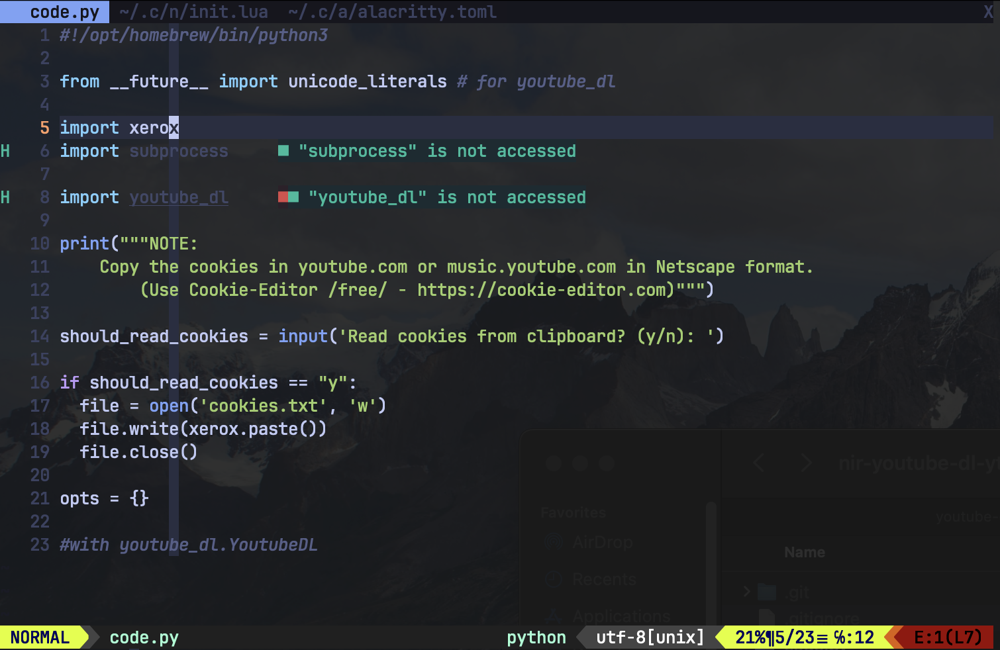

# Python environments & packages



### Prerequisites:
- OS: Mac OS X
- Homebrew

## pipenv

```sh
brew install pipenv
```

## Install packages

```sh
# Install an example package

pipenv install xerox
```

This creates a `Pipfile` and `Pipfile.lock`. We can add `Pipfile` to Git.

## Opening VIM (NeoVIM) with pipenv packages

```sh
pipenv shell
nvim
```

### Python support in NeoVIM (init.lua version)

Assumes NeoVIM has Plug package manager setup.

```lua
-- ~/.config/nvim/init.lua

vim.call('plug#begin', '~/AppData/Local/nvim/plugged')

-- LSPCONFIG
Plug 'neovim/nvim-lspconfig'

vim.call('plug#end')

-- LSP CONFIG - SETUP
require("lspconfig")["pyright"].setup {
  -- npm i -g pyright
}
```
